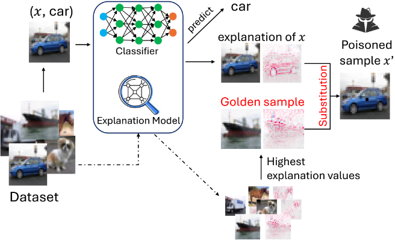

# Extension of XSub (Explanation-Driven Adversarial Attack against Blackbox Classifiers via Feature Substitution) to Medical Image Classifiers

This repository contains the code to extend the results of the [Explanation-Driven Adversarial Attack against Blackbox Classifiers via Feature Substitution](https://ieeexplore.ieee.org/document/10825935) paper to medical image classifiers. 



## Installation 

### Cloning and handling dependencies 

Clone the repo:

```
git clone https://github.com/xsub.git
```

Create a conda environment and activate it:

```
conda env create -f environment.yml
conda activate xsub
```

### Downloading and preparing data 

This repository includes a rearranged version of the [Breast Ultrasound Images Dataset](https://www.kaggle.com/datasets/aryashah2k/breast-ultrasound-images-dataset/data) as an example. When working with any other dataset, make sure dataset is stored in the following order:
```
data #root data directory
|
|__ class_0 
    |__ image_0
    |__ image_1
    ...
|__ class_1
    |__ image_0
    |__ image_1
    ...
...
|__ class_n
    |__ image_0
    |__ image_1
    ...
```
The [dataprep.py](dataprep.py) file contains code to prepare the data. The code has been written to be as general and applicable to as many datasets, but you can modify this file to suit your own needs and the specificity of your datasets. 

## Running the XSub code 
Running the [xsub.py](xsub.py) file should give you the results of the attack on a given dataset:
```
python3 xsub.py
```
[xsub_backdoor.py](xsub_backdoor.py) will be updated in the future.

Within [xsub.py](xsub.py), there are lines of code you can modify to change the hyperparameters of the attack. Note that the code in this repository is most suitable for attacks using only 1 feature (i.e., $K=1$). Attacks with more features will be updated soon. 

The [config.py](utils/config.py) file can also be modified if you need to:
- Resize images
- Adjust batch size
- Adjust hyperparameters for training a different classifier
- Change directories for saving your progress


